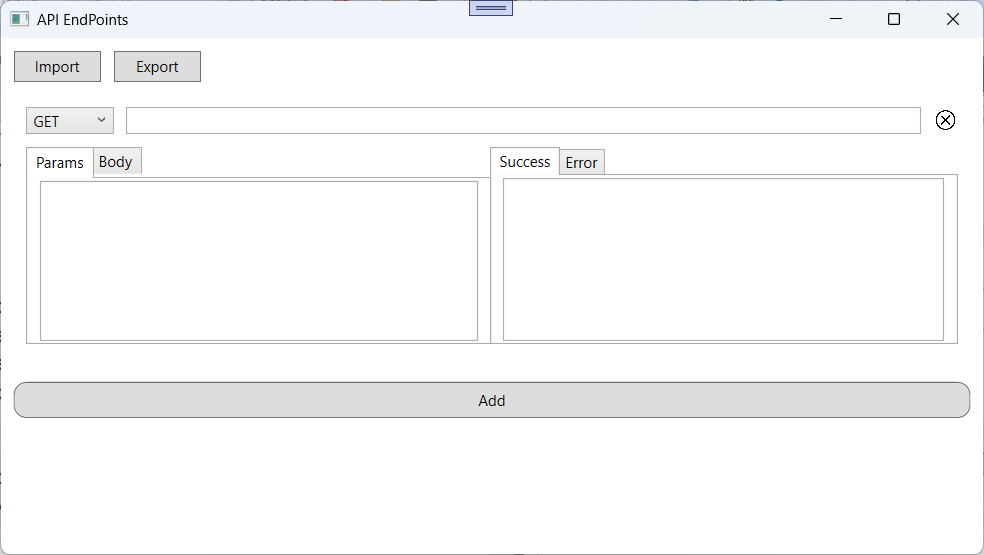

# API EndPoint 
A simple desktop app buit using WPF to summerize APIs endpoints

## EndPoint
- Type: GET, POST, PUT, DELETE
- Url
- Params: request URL params
- Body: request body
- Success: response on success
- Error: response on error

## Features
- Import/Export Json files
- Add/Delete/Edit endpoints

## Screensots
